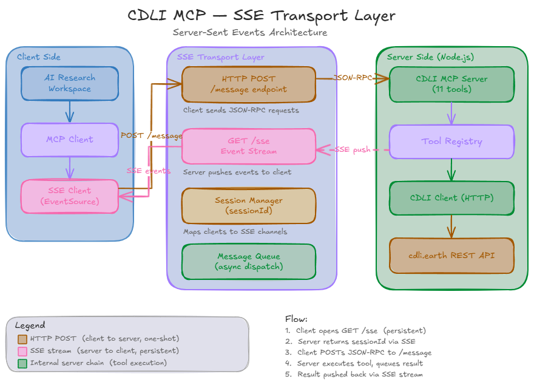

<h1 align="center">CDLI MCP Server</h1>

<p align="center">
  <strong>Model Context Protocol Server for the Cuneiform Digital Library Initiative</strong><br>
  <em>Providing structured access to the CDLI corpus via MCP</em>
</p>

<p align="center">
  <a href="https://cdli.earth">CDLI Website</a> •
  <a href="#available-tools-11">Tools (11)</a> •
  <a href="#claude-desktop-setup">Setup Guide</a> •
  <a href="#architecture">Architecture</a>
</p>

---

## Overview

A [Model Context Protocol (MCP)](https://modelcontextprotocol.io/) server that exposes the full [CDLI (Cuneiform Digital Library Initiative)](https://cdli.earth) corpus as structured tools for AI agents.

This server connects to the CDLI public REST API and allows any MCP-compatible client (like **Claude Desktop**) to:
- **Search** the corpus with free-text or structured metadata queries
- **Read** cuneiform inscriptions in ATF transliteration format
- **Browse** artifacts, authors, publications, periods, and proveniences
- **Execute** CQP linguistic queries via the CQP4RDF system
- **Generate** research with automatic artifact citations

**Transport:** `stdio` (Claude Desktop) and `SSE` (web-based MCP clients)

---

## Architecture


### How Data Flows

1. A client submits a natural language request (e.g., *"Find Sumerian administrative tablets about barley from Ur III period"*).
2. The client analyzes the request and invokes the `advanced_search` tool with `{ language: "Sumerian", genre: "Administrative", period: "Ur III", translation_text: "barley" }`.
3. The MCP server translates these parameters into CDLI URL query parameters.
4. The CDLI website processes the query and returns the relevant data.
5. The server parses the response, enriches it with metadata, and returns formatted text.
6. The client reads the results and presents them with standard citations.

---

## Available Tools (11)

### Artifact Discovery

| Tool | Description |
|------|-------------|
| `search_artifacts` | Free-text search across the CDLI corpus. Good for general keyword queries. |
| `advanced_search` | **Structured search** with specific filters: language, genre, period, provenience, material, collection, artifact_type, translation_text, publication. Maps to [CDLI Advanced Search](https://cdli.earth/search/advanced). |
| `get_artifact` | Retrieve full metadata for a single artifact by P-number. Includes publications, collections, materials, and inscription. |
| `list_artifacts` | Paginated browsing of the artifact catalog. |

### Inscription & Linguistic Analysis

| Tool | Description |
|------|-------------|
| `get_inscription` | Retrieve ATF (ASCII Transliteration Format) text for an artifact. Includes transliteration lines and English translations. |
| `cqp_query` | Execute **CQP (Corpus Query Processor)** linguistic queries via the [CQP4RDF](https://cdli.earth/cqp4rdf/) system. Supports lemma, form, and part-of-speech searches. |

### Scholarly Data

| Tool | Description |
|------|-------------|
| `get_authors` | List authors/scholars registered in CDLI (2,700+). |
| `get_publications` | Browse publications referenced by CDLI artifacts. |

### Historical & Geographic Context

| Tool | Description |
|------|-------------|
| `get_periods` | All 32 historical periods with chronological sequence. |
| `get_proveniences` | Archaeological find sites (e.g., Ur, Nippur, Girsu). |

### System

| Tool | Description |
|------|-------------|
| `ping` | Server liveness check with version info. |

---

## Quick Start

### Prerequisites

- **Node.js** ≥ 18 ([download](https://nodejs.org/))
- **npm** ≥ 9 (included with Node.js)
- **Claude Desktop** app ([download](https://claude.ai/download))

### 1. Clone & Install

```bash
git clone <your-repo-url>
cd cdli-ai-prototype

npm install
```

### 2. Build

```bash
npm run build
```

This compiles TypeScript from `src/` into `dist/`.

### 3. Run

**stdio mode** (default — for Claude Desktop):
```bash
npm start
```

**SSE mode** (for web-based MCP clients):
```bash
npm run start:sse
```

The SSE server starts on port `3000` by default. Use a custom port:
```bash
node dist/index.js --sse 8080
```

### 4. Test with MCP Inspector (Optional)

```bash
npm run inspect
```

Opens a web UI at `http://localhost:6274` where you can test each tool individually.

---

## SSE Transport



The SSE transport exposes the MCP server over HTTP, allowing web-based clients to connect.

### Endpoints

| Method | Path | Description |
|--------|------|-------------|
| `GET` | `/sse` | Establish an SSE event stream. Returns a `sessionId` in the initial event. |
| `POST` | `/messages?sessionId=<id>` | Send JSON-RPC messages to the server using the session ID from `/sse`. |
| `GET` | `/health` | Health check. Returns server status, version, and tool count. |

### Connection Flow

1. Client sends `GET /sse` to open an event stream
2. Server responds with a `sessionId` in the first SSE event
3. Client sends JSON-RPC tool calls via `POST /messages?sessionId=<id>`
4. Server streams responses back over the SSE connection

### Example

```bash
# Start SSE server
npm run start:sse

# In another terminal, check health
curl http://localhost:3000/health
```

---

## Claude Desktop Setup

### Step 1: Build the Server

```bash
cd /path/to/cdli-ai-prototype
npm install
npm run build
```

### Step 2: Open Claude Desktop Config

The config file location depends on your OS:

| OS | Path |
|----|------|
| **Windows** | `%APPDATA%\Claude\claude_desktop_config.json` |
| **macOS** | `~/Library/Application Support/Claude/claude_desktop_config.json` |
| **Linux** | `~/.config/Claude/claude_desktop_config.json` |

On Windows, open it with:
```cmd
notepad %APPDATA%\Claude\claude_desktop_config.json
```

### Step 3: Add the CDLI MCP Server

If you already have a config file with other settings, **merge** the `mcpServers` block into it:

```json
{
  "mcpServers": {
    "cdli": {
      "command": "node",
      "args": ["/absolute/path/to/cdli-ai-prototype/dist/index.js"]
    }
  }
}
```

**Example: full config with existing preferences:**

```json
{
  "preferences": {
    "coworkWebSearchEnabled": true,
    "sidebarMode": "chat"
  },
  "mcpServers": {
    "cdli": {
      "command": "node",
      "args": ["/absolute/path/to/cdli-ai-prototype/dist/index.js"]
    }
  }
}
```

> **Important:** Use the **absolute path** to `dist/index.js`. Replace `/absolute/path/to/cdli-ai-prototype` with your actual clone path. (On Windows, remember to double-escape backslashes, e.g., `C:\\Users\\name\\cdli-ai-prototype\\dist\\index.js`)

> **If Node.js isn't found:** Replace `"command": "node"` with the full path:
> `"command": "C:\\Program Files\\nodejs\\node.exe"`

### Step 4: Restart Claude Desktop

**Completely quit** Claude Desktop (right-click the system tray icon → Quit), then reopen it.

### Step 5: Verify

Look for the **🔧 hammer icon** next to the text input. Click it to see the 11 CDLI tools listed.

### Step 6: Usage Examples

Here are some example prompts that can be used with an MCP client (such as Claude Desktop):

| Example Prompt | Tool Executed |
|--------|-----------|
| *"Search CDLI for Sumerian administrative tablets about barley"* | `search_artifacts` |
| *"Find Old Babylonian literary texts from Nippur"* | `advanced_search` |
| *"Get the full metadata for artifact P254876"* | `get_artifact` |
| *"Show me the inscription and translation for P254876"* | `get_inscription` |
| *"What historical periods are in CDLI?"* | `get_periods` |
| *"Find all occurrences of the lemma 'lugal' (king)"* | `cqp_query` |
| *"List publications in the CDLI database"* | `get_publications` |
| *"What archaeological sites are recorded in CDLI?"* | `get_proveniences` |

---


---

## Artifact Citation Standard

All tool outputs include proper CDLI citation format for scholarly traceability:

```
P254876 — CDLI Literary 000795, ex. 052
https://cdli.earth/artifacts/254876
```

This ensures every AI-generated response can be traced back to the original cuneiform artifact in the CDLI database.

---

## Project Structure

```
cdli-ai-prototype/
├── src/
│   ├── index.ts                          # Server entry point (stdio transport)
│   ├── cdli-client.ts                    # HTTP client for cdli.earth REST API
│   └── tools/
│       ├── index.ts                      # Tool registry (barrel export)
│       ├── search-artifacts/index.ts     # Free-text corpus search
│       ├── advanced-search/index.ts      # Structured field-based search
│       ├── get-artifact/index.ts         # Single artifact metadata
│       ├── list-artifacts/index.ts       # Paginated artifact listing
│       ├── get-inscription/index.ts      # ATF text + translation
│       ├── get-authors/index.ts          # Author listing
│       ├── get-publications/index.ts     # Publication listing
│       ├── get-periods/index.ts          # Historical periods
│       ├── get-proveniences/index.ts     # Archaeological sites
│       ├── cqp-query/index.ts            # CQP linguistic queries
│       └── ping/index.ts                 # Liveness check
├── dist/                                 # Compiled JavaScript (git-ignored)
├── package.json
├── tsconfig.json
├── .env.example
├── .gitignore
└── README.md
```

---

## Configuration

Optional `.env` file:

```env
CDLI_API_BASE_URL=https://cdli.earth     # API base URL (default: https://cdli.earth)
CDLI_API_TIMEOUT=30000                    # Request timeout in ms (default: 30000)
```

---

## Development

### Adding a New Tool

1. Create `src/tools/<tool-name>/index.ts`
2. Export: `name`, `description`, `inputSchema` (Zod shape), `handler`
3. Import and add to `src/tools/index.ts`
4. Rebuild: `npm run build`

### Tool Template

```typescript
import { z } from 'zod';

export const name = 'my_tool';
export const description = 'What this tool does';
export const inputSchema = {
  param: z.string().describe('Parameter description'),
};

export async function handler(args: { param: string }): Promise<string> {
  // Implementation
  return 'result';
}
```

### Testing

```bash
# Build and test with MCP Inspector
npm run inspect

# Manual build
npm run build

# Run directly (for debugging)
npm start
```

---

## References

- [CDLI — Cuneiform Digital Library Initiative](https://cdli.earth)
- [CDLI Advanced Search](https://cdli.earth/search/advanced)
- [CDLI CQP4RDF](https://cdli.earth/cqp4rdf/)
- [Model Context Protocol](https://modelcontextprotocol.io/)
- [MCP TypeScript SDK](https://github.com/modelcontextprotocol/typescript-sdk)
- [MCP — Build a Server (Guide)](https://modelcontextprotocol.io/docs/develop/build-server)
- [Claude Desktop MCP Integration](https://modelcontextprotocol.io/docs/tools/inspector)


## License

MIT

---

<p align="center">
  <strong>GSoC 2026 — CDLI AI Search & MCP Agent Platform</strong><br>
  <em>Cuneiform Digital Library Initiative</em>
</p>
